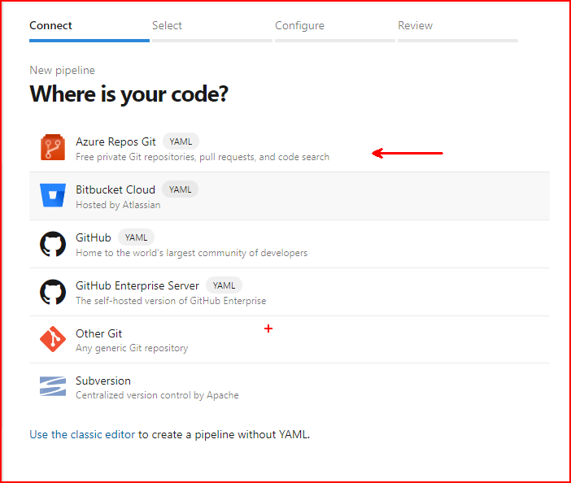
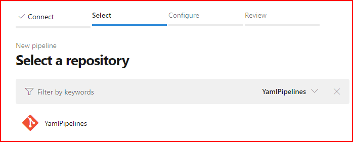
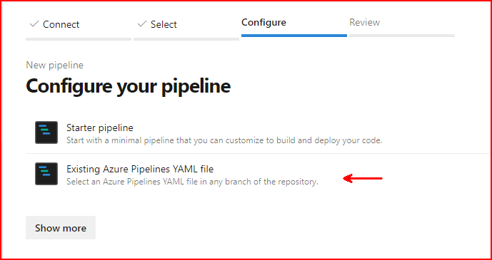
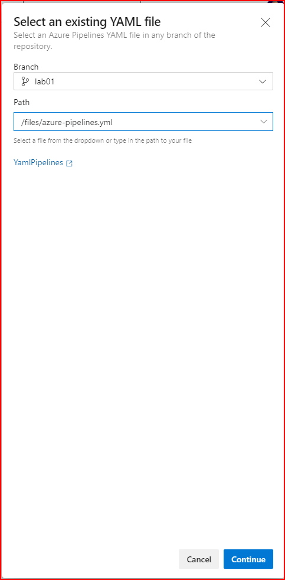

# Lab 01
## Introduction 
In lab one we will create the basis for our yaml pipeline.

## Tasks
1. In your repository create a branch called <b>lab01</b>.
2. Make lab01 your working branch.
3. Add a file with the ".yml" extension in your branch and add the following content to the file.

```yaml
trigger:
- none

steps:
- task: PowerShell@2
  inputs:
    targetType: 'inline'
    script: |
      # Write your PowerShell commands here.
      Write-Host "Hello World"
```

4. Save and commit your change.
5. Navigate to Pipelines in Pipelines.
6. Create a new pipeline as follows.









### **Once you select to continue you will be taken to an editor with you YAML file loaded.**

## **Will the pipeline run automatically? Why or why not?**

5. Ensure that your pipeline runs.