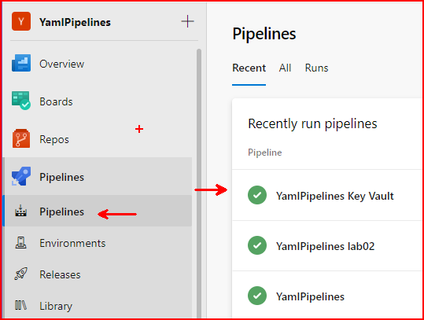
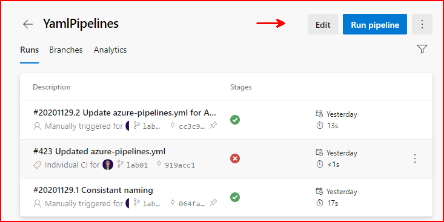
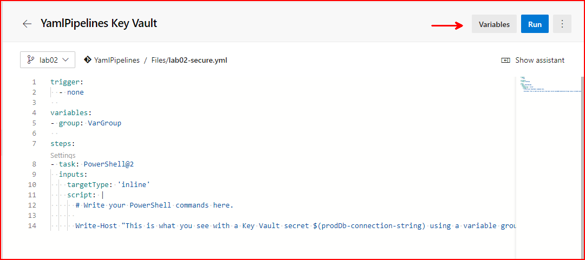
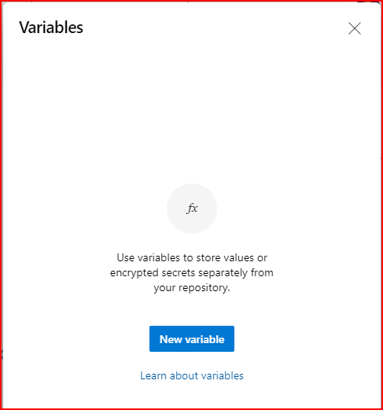
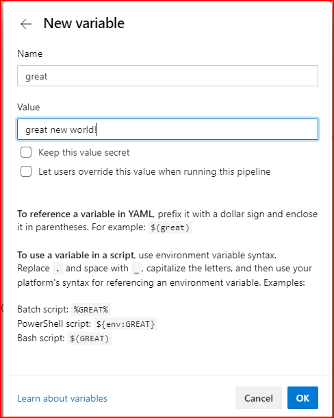

# Lab 02
## Introduction 
In lab we will explore the use of variables.

## Tasks
1. Using the already run pipeline navigate to and Edit the pipeline.





2. Navigate to variables in the upper left corner of the editor window.



3. Add a new variable and name it great, give a value like "great big world!"





4. Update your script and add a second **Write-Host "It's a $(great)** line after the first.

```yaml
trigger:
- lab02

variables:
  world: the whole world

steps:
- task: PowerShell@2
  inputs:
    targetType: 'inline'
    script: |
      # Write your PowerShell commands here.
      Write-Host "Hello $(world)"
      Write-Host "It's a $(great)"
```

5. Save and commit your change.

## Will the pipeline run automatically? Why or why not?

6. Ensure that your pipeline runs.
7. What was the message displayed in the log from the second Write-Host command?

## **Take note that when creating the variable you had options to make the value secret and to allow the value to be overwritten during run time.**